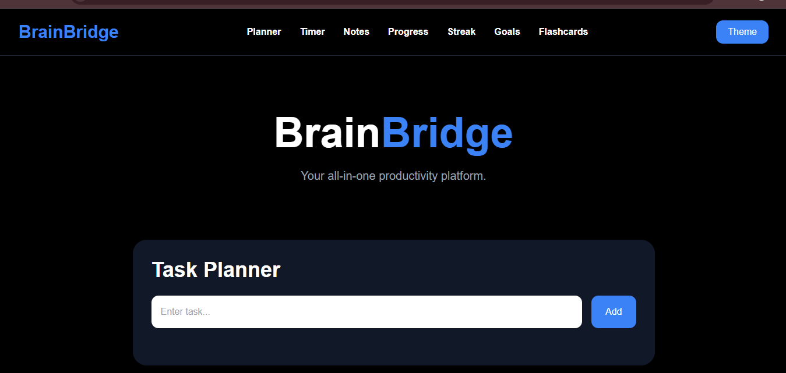

# BrainBridge

BrainBridge is a smart student productivity platform designed to help students stay organized, focused, and motivated while studying. The platform combines multiple productivity and learning tools into one modern dashboard for a better study experience.

---

## Features

- Task Planner
- Pomodoro Timer
- Notes System
- Progress Tracker
- Study Streak Counter
- Daily Goals
- Flashcards
- Motivational Quotes
- Study Music Player
- Dark/Light Theme Toggle
- Responsive Modern UI
- LocalStorage Data Saving

---

## Technologies Used

- HTML5
- Tailwind CSS
- JavaScript

---

## Screenshot



---

## How to Run

1. Download or clone the repository
2. Open the project folder
3. Run `index.html` in your browser

---

## Project Structure

```bash
BrainBridge/
│
├── index.html
├── script.js
├── style.css
├── README.md
├── screenshot.png
└── music.mp3
```

---

## How It Works

BrainBridge stores user data using browser localStorage. Tasks, notes, flashcards, streaks, and progress remain saved even after refreshing the website.

---

## Future Improvements

- Firebase Integration
- User Authentication
- AI Study Assistant
- Cloud Storage
- Mobile App Version
- Real-time Collaboration

---

## Authors

- Tafheem Farooq

---

## License

This project was created for educational and hackathon purposes.
